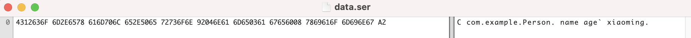
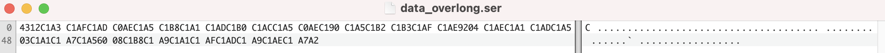

# Hessian UTF-8 Overlong Encoding

Reference: [https://exp10it.io/2024/02/hessian-utf-8-overlong-encoding/](https://exp10it.io/2024/02/hessian-utf-8-overlong-encoding/)

Dependency: `com.caucho.hessian:4.0.66`

Comparison

Some codes in other serialization libraries based on Hessian, which may be affected by UTF-8 Overlong Encoding

[https://github.com/apache/dubbo-hessian-lite/blob/ca001b4658227d5122f85bcb45032a0dac4faf0d/src/main/java/com/alibaba/com/caucho/hessian/io/Hessian2Output.java#L1360](https://github.com/apache/dubbo-hessian-lite/blob/ca001b4658227d5122f85bcb45032a0dac4faf0d/src/main/java/com/alibaba/com/caucho/hessian/io/Hessian2Output.java#L1360)

[https://github.com/sofastack/sofa-hessian/blob/54bc9654c7f1a573e3e5d92479be9223d9573895/src/main/java/com/caucho/hessian/io/Hessian2Output.java#L1529](https://github.com/sofastack/sofa-hessian/blob/54bc9654c7f1a573e3e5d92479be9223d9573895/src/main/java/com/caucho/hessian/io/Hessian2Output.java#L1529)